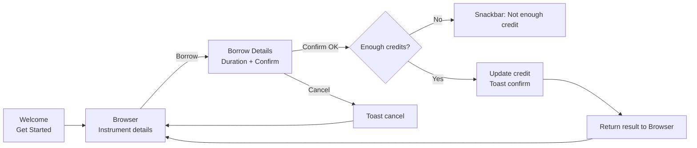

# Instrument Rental — Android App (Kotlin)

[](https://developer.android.com/)
[](https://kotlinlang.org/)
[](https://m3.material.io/)
[](https://developer.android.com/training/testing/espresso)
[](#)

A clean, two-screen Android app for **renting musical instruments**. Users browse instruments, pick a color, select a rental duration, and confirm the borrow. The app follows Material Design, passes data between screens using **Intents + Parcelable**, returns results with **onActivityResult**, and surfaces feedback with **Snackbar/Toast**. Automated UI checks are written with **Espresso**.

## Table of Contents
- [Features](#features)
- [Screens](#screens)
- [Architecture](#architecture)
- [Data Flow](#data-flow)
- [UI/UX Choices](#uiux-choices)
- [Validation & Error Handling](#validation--error-handling)
- [Testing](#testing)
- [Project Structure](#project-structure)
- [Requirements](#requirements)
- [Quick Start](#quick-start)
- [Usage](#usage)
- [Roadmap](#roadmap)
- [Credits](#credits)
- [License](#license)

## Features
- **Browse instruments** with image, name, description, rating, and **credits per month**.
- **Select options**: color via `RadioGroup` + `RadioButton`; rating via `RatingBar`.
- **Borrow flow**: enter duration (months), validate inputs, and confirm.
- **Credit tracking**: show current credit; block actions when credits are insufficient.
- **Responsive feedback**:
  - **Snackbar** for actionable errors near the source control.
  - **Toast** for quick confirmations/cancellations.
- **Data passing**: `Parcelable` model moves instrument data between activities.
- **Round-trip result**: return updated credit to the browser screen with `onActivityResult`.
- **Automated UI tests** with Espresso: navigation, browsing, validation, and credit updates.

## Screens
- **Welcome / Get Started** → CTA that launches browsing.
- **Instrument Browser** → Next/Prev browsing; shows details, rating, and color options; “Borrow”.
- **Borrow Details** → Selected instrument recap, duration input, **Confirm** / **Cancel**.

> Add your screenshots here once you export them from the report:
> - `images/welcome.png`
> - `images/browse.png`
> - `images/borrow.png`

## Architecture
A simple two-activity flow with clear responsibilities.

| Layer | Responsibility | Key Pieces |
|------:|:--------------|:-----------|
| UI | Material components, layout XML | ConstraintLayout, LinearLayout, ImageView, TextView, Button, RatingBar, RadioGroup |
| Data Model | Parcelable instrument payload | `data class Instrument(...): Parcelable` |
| Navigation | Screen-to-screen and result return | `Intent`, `putExtra`, `startActivityForResult`, `onActivityResult` |
| Feedback | User messages | `Snackbar` (errors, validation), `Toast` (confirm/info) |
| Tests | UI automation | Espresso test cases (navigation/browse/validate/credit) |

## Data Flow


### Parcelable Model (example)
```kotlin
@Parcelize
data class Instrument(
  val name: String,
  val description: String,
  val price: Int,          // credits per month
  val rating: Float,
  val colorOptions: List<String>,
  val imageRes: Int
) : Parcelable
```

### Passing Data and Returning Results (example)
```kotlin
// Browser → Borrow Details
val intent = Intent(this, BorrowDetailsActivity::class.java).apply {
  putExtra("instrument", currentInstrument)
  putExtra("currentCredit", currentCredit)
  putExtra("selectedColor", selectedColor)
}
startActivityForResult(intent, REQUEST_BORROW)

// Borrow Details → Browser (after confirm)
val result = Intent().putExtra("updatedCredit", newCredit)
setResult(Activity.RESULT_OK, result)
finish()

// Browser receives result
override fun onActivityResult(req: Int, res: Int, data: Intent?) {
  super.onActivityResult(req, res, data)
  if (req == REQUEST_BORROW && res == Activity.RESULT_OK) {
    currentCredit = data?.getIntExtra("updatedCredit", currentCredit) ?: currentCredit
    creditView.text = "Credit: $currentCredit"
  }
}
```

## UI/UX Choices
- **Material Design** styling for buttons, text, spacing, and consistent theming.
- **ConstraintLayout** as the default for flexible responsive positioning.
- **LinearLayout** for simple vertical/horizontal sections where appropriate.
- **Contextual messaging**: use Snackbar for input/validation issues placed near the control; Toast for short success info.

## Validation & Error Handling
- **Duration checks**: required, positive integer.
- **Color required**: block proceed if no color is chosen (Snackbar prompt).
- **Credit guard**: compare `duration * price` against `currentCredit`; show Snackbar when insufficient.
- **Success & cancel**: confirm with Toast.

## Testing
Automated UI tests with **Espresso** cover:
- **Navigation**: welcome → browser → borrow → back with result.
- **Browsing**: “Next” updates instrument name/description/image/price correctly.
- **Validation**: empty/invalid duration and missing color show Snackbar.
- **Credit handling**: confirming a borrow deducts credits and returns updated value.

Example navigation test (sketch):
```kotlin
@Test fun navigationWorks() {
  onView(withId(R.id.getStarted)).perform(click())
  onView(withId(R.id.instrumentDetailsLayout)).check(matches(isDisplayed()))
  onView(withId(R.id.nextButton)).perform(click())
  onView(withId(R.id.borrowButton)).perform(click())
  onView(withId(R.id.borrowDetailsLayout)).check(matches(isDisplayed()))
}
```

## Project Structure
```text
/app
  src/main/java/...
    ui/
      MainActivity        # Welcome / Get Started
      BrowserActivity     # Browse instruments (a.k.a. MainActivity2 in report)
      BorrowDetailsActivity
    model/
      Instrument.kt       # Parcelable data class
    util/
      Extensions.kt       # (optional helpers)
  src/androidTest/java/... # Espresso tests
  src/main/res/
    layout/               # XML layouts (ConstraintLayout/LinearLayout)
    drawable/             # icons / images
    values/               # colors, styles (Material theme), strings
```

## Requirements
- Android Studio (latest stable)
- Kotlin plugin (bundled)
- Android SDK + emulator/device

## Quick Start
```bash
# Clone
git clone https://github.com/your-username/instrument-rental-android.git
cd instrument-rental-android

# Open with Android Studio
# Build → Run on emulator or device
```

## Usage
1. Launch app and tap **Get Started**.
2. Browse instruments with **Next**; pick a **Color**.
3. Tap **Borrow**, enter **Duration (months)**, **Confirm**.
4. If credits are enough → success Toast; credit is deducted and shown back on the browser screen.  
   If not enough → Snackbar explains what’s missing.

## Roadmap
- Login/profile to persist credit and history.
- Animated transitions and richer UI states.
- Instrument search/filter and favorites.
- Local persistence (Room) or remote backend (Firebase) for real data.

## Credits
- Built with **Kotlin**, **Android Studio**, **Material Design**, and **Espresso**.
- Wireframes created in **Figma**.
- Report, sketches, and code screenshots informed this README.

## License
MIT.
